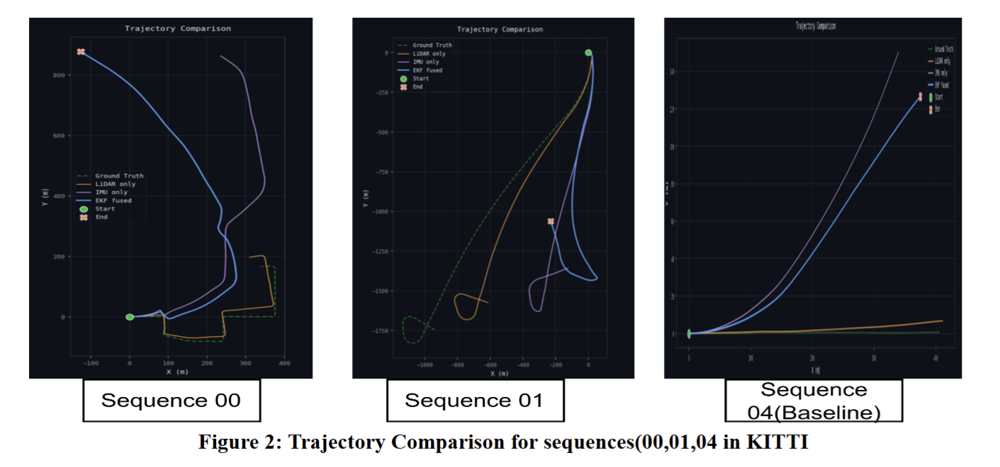

# LiDAR-IMU Fusion Odometry

Point-to-plane ICP scan matching fused with IMU preintegration via a 15-state Error-State Kalman Filter, evaluated on the KITTI raw dataset.



## Setup

```bash
pip install numpy open3d matplotlib huggingface_hub
```

---

## Dataset

Hosted on HuggingFace: [omrastogi/lidar_imu_odometry](https://huggingface.co/datasets/omrastogi/lidar_imu_odometry)

```bash
huggingface-cli download omrastogi/lidar_imu_odometry --repo-type dataset --local-dir data/
```

Expected layout after download:

```
data/raw/
└── 2011_10_03/
    ├── calib_cam_to_cam.txt
    ├── calib_imu_to_velo.txt
    ├── calib_velo_to_cam.txt
    └── 2011_10_03_drive_0027_sync/
        ├── oxts/data/               # IMU/GPS .txt files (~100 Hz)
        └── velodyne_points/data/    # LiDAR .bin files (~10 Hz)
```

> **License:** KITTI raw data — [CC BY-NC-SA 3.0](https://creativecommons.org/licenses/by-nc-sa/3.0/). Non-commercial use only.

---

## Pipeline

```
LiDAR frames ──► Preprocess (voxel + normals)
                        │
                        ▼
IMU batch ──► Preintegration ──► EKF Predict (T_init for ICP)
                        │
                        ▼
              ICP Scan Matching ──► T_icp
                        │
                        ▼
              EKF Update ──► Fused pose (R, v, p)
```

---

## Running the Code

All scripts take the drive sync folder as the first argument:
```
data/raw/2011_10_03/2011_10_03_drive_0027_sync
```

### 1. KITTI Loader — verify dataset

```bash
python kitti_loader.py data/raw/2011_10_03/2011_10_03_drive_0027_sync
```

### 2. ICP-only odometry

Chains point-to-plane ICP across frames. Ground truth loaded automatically from OXTS.

```bash
python scan_matching_icp.py data/raw/2011_10_03/2011_10_03_drive_0027_sync \
    --frames 200 \
    --voxel-size 0.3 \
    --max-dist 1.0 \
    --max-iters 30 \
    --save-plot traj_icp.png
```

| Flag | Default | Description |
|------|---------|-------------|
| `--frames` | 50 | Frames to process |
| `--voxel-size` | 0.3 | Voxel downsample size (m) |
| `--max-dist` | 1.0 | Max ICP correspondence distance (m) |
| `--max-iters` | 30 | Max ICP iterations |
| `--save-plot` | — | Save trajectory plot to file |
| `--gt-oxts` | — | Override GT path (auto-detected by default) |

### 3. LiDAR-IMU EKF fusion

Uses IMU preintegration to warm-start ICP, then fuses both in a 15-state ESKF.

```bash
python ekf.py data/raw/2011_10_03/2011_10_03_drive_0027_sync \
    --frames 200 \
    --voxel-size 0.3 \
    --max-dist 1.0 \
    --max-iters 30 \
    --sigma-r 0.01 \
    --sigma-t 0.05 \
    --gt-oxts data/raw/2011_10_03/2011_10_03_drive_0027_sync/oxts/data \
    --save-plot traj_ekf.png
```

| Flag | Default | Description |
|------|---------|-------------|
| `--sigma-r` | 0.01 | ICP rotation noise std (rad) |
| `--sigma-t` | 0.05 | ICP translation noise std (m) |
| `--gt-oxts` | — | Path to `oxts/data` for GT overlay |

### 4. OXTS ground truth converter

Converts raw GPS/IMU data to local-frame poses and plots the GT trajectory.

```bash
python oxts_to_poses.py data/raw/2011_10_03/2011_10_03_drive_0027_sync/oxts/data \
    --frames 200 \
    --save-poses gt_poses.txt \
    --save-plot gt_traj.png
```

---

## EKF Details (`ekf.py`)

15-state Error-State Kalman Filter fusing LiDAR (ICP) and IMU.

**State vector** (error state):
```
δx = [δφ(3)  δv(3)  δp(3)  δbg(3)  δba(3)]
      orient  vel    pos    gyro    accel
              ── all 15 components ──
```

**Nominal state** stored separately: `R` (3×3), `v` (3,), `p` (3,), `bg` (3,), `ba` (3,).

**Predict step** (`ekf.predict(imu_batch, calib, dt_lidar)`):
- Runs `IMUPreintegrator` over the IMU batch between frames
- Propagates nominal state `(R, v, p)` forward
- Builds `F` (15×15 Jacobian) and propagates covariance `P = F P Fᵀ + Q`
- Returns `T_predicted` (4×4) as warm-start for ICP

**Update step** (`ekf.update(T_icp)`):
- Converts ICP result to body-frame `(R_meas, t_meas)`
- Computes 6D innovation: `y = [log(R_pred.T @ R_meas),  t_meas − t_pred]`
- Builds measurement Jacobian `H` (6×15), computes Kalman gain `K`
- Injects correction into nominal state; updates `P` via Joseph form
- Returns fused world-frame pose (4×4)

**Key design choices:**
- Initial velocity bootstrapped from OXTS `(vf, vl, vu)` fields for accurate IMU prediction from frame 0
- `dt_lidar` passed to predict to correctly couple velocity→position when IMU coverage is sparse
- Joseph-form covariance update for numerical stability

---

## Key Files

| File | Purpose |
|------|---------|
| `kitti_loader.py` | LiDAR scans, IMU data, calibration |
| `imu_integrator.py` | IMU preintegration with bias Jacobians |
| `oxts_to_poses.py` | OXTS GPS → local 4×4 poses (ground truth) |
| `scan_matching_icp.py` | ICP-only odometry pipeline |
| `ekf.py` | 15-state LiDAR-IMU ESKF fusion pipeline |
| `sanity_check.py` | Debug / validation utilities |
